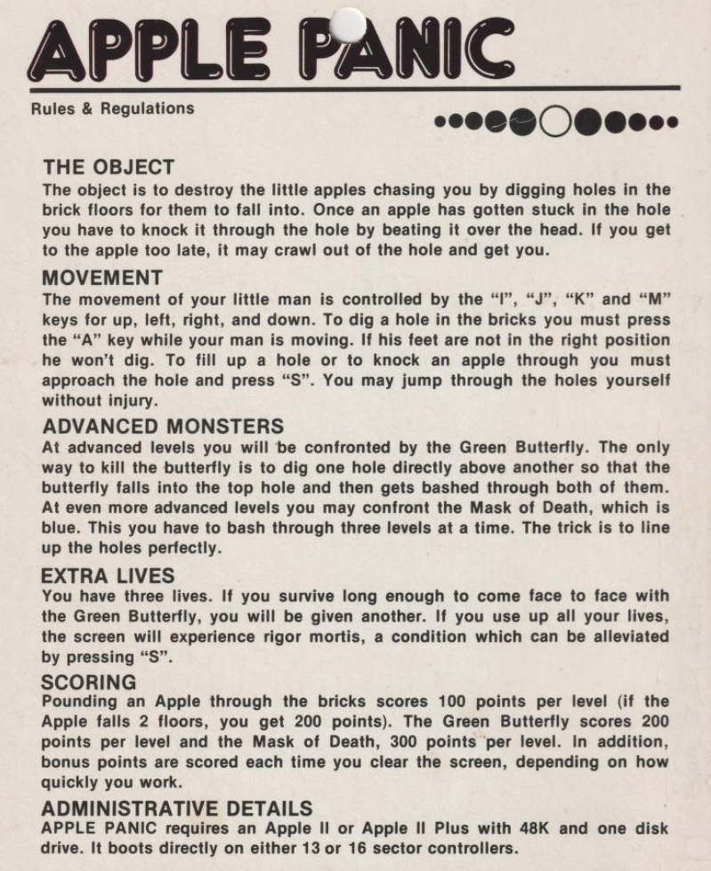

# Apple Panic (Broderbund, 1981)

Reverse engineering the copy protection and game code of *Apple Panic* by Ben Serki, published by Broderbund Software in 1981 for the Apple II.



Apple Panic is a platformer where the player digs holes in brick floors to trap monsters (apples that have gone bad), then bashes them on the head before they climb out. Inspired by the arcade game *Space Panic*, it was one of the earliest platform games on home computers.

The game ships on a single 5.25" floppy disk with **nine layers of copy protection** — an unusually aggressive scheme for 1981 that defeated virtually all automated copy programs of the era.

## The Disk

| | |
|---|---|
| **Format** | WOZ2 (flux-level capture by Applesauce) |
| **Tracks used** | 14 of 35 (tracks 0-13) |
| **Encoding** | 5-and-3 GCR (13-sector), with one 6-and-2 boot sector |
| **Total capacity** | ~46 KB |
| **Game binary** | ~27 KB ($4000-$A7FF) |
| **Boot time** | 69.8 million emulated 6502 instructions |

## Copy Protection

Nine distinct protection layers, each defeating a different class of copy tool:

| # | Mechanism | What It Defeats |
|---|-----------|-----------------|
| 1 | Dual-format track 0 (6-and-2 + 5-and-3) | Standard DOS 3.3 copy utilities |
| 2 | Invalid address field checksums | Nibble copiers that validate headers |
| 3 | GCR table corruption (ASL x3) | Raw nibble copies decoded with fresh tables |
| 4 | Intentionally bad checksum on sector 11 | Copiers that validate all sector checksums |
| 5 | Custom post-decode permutation ($0346) | Manual analysis with standard decode assumptions |
| 6 | Self-modifying code | Static disassembly |
| 7 | Non-standard $DE address markers (tracks 1+) | Copiers looking for standard $D5 prologs |
| 8 | Per-track third-byte variations | Copiers that handle $DE but assume fixed prologs |
| 9 | Non-standard sector/track numbers | Copiers expecting sector 0-12 and matching track numbers |

See [CopyProtection.md](CopyProtection.md) for the full technical analysis.

## How to Extract the Game

Using the [nibbler](../nibbler/) toolkit:

```bash
# Scan the disk
python -m nibbler scan "apple-panic/Apple Panic - Disk 1, Side A.woz"

# Detect all copy protection
python -m nibbler protect "apple-panic/Apple Panic - Disk 1, Side A.woz"

# Boot-trace and extract the game binary ($4000-$A7FF)
python -m nibbler boot "apple-panic/Apple Panic - Disk 1, Side A.woz" \
    --stop 0x4000 --dump 0x4000-0xA7FF --save game.bin
```

## Files

### Disk Images and Binaries

| File | Description |
|------|-------------|
| `Apple Panic - Disk 1, Side A.woz` | Original WOZ2 flux-level disk image (Applesauce capture) |
| `ApplePanic_runtime.bin` | Runtime memory image (43,008 bytes, $0000-$A7FF, extracted via boot emulation) |
| `ApplePanic_original.dsk` | Standard DSK conversion of the WOZ image |

### Documentation

| File | Description |
|------|-------------|
| [ReverseEngineeringHistory.md](ReverseEngineeringHistory.md) | **The full narrative** — blog-post-ready account of the entire investigation |
| [CopyProtection.md](CopyProtection.md) | Definitive technical analysis of all 9 protection layers |
| [ApplePanic_CopyProtection_Report.md](ApplePanic_CopyProtection_Report.md) | Earlier analysis report (annotated with corrections) |
| [DecodingTools.md](DecodingTools.md) | Guide to the investigation scripts |
| [PLAN.md](PLAN.md) | The original reconstruction plan |

### Assembly

| File | Description |
|------|-------------|
| [ApplePanic.asm](ApplePanic.asm) | Game code disassembly — tracks 6-13, $4000-$A7FF (8,800+ lines, 104 subroutines) |
| [ApplePanic_Boot_T0.asm](ApplePanic_Boot_T0.asm) | Track 0 sector data — anti-copy trap, RWTS, byte reconstruction |
| [ApplePanic_Boot_Stage2.asm](ApplePanic_Boot_Stage2.asm) | Boot RWTS + stage 2 loader — $0200-$03FF, GCR corruption, custom post-decode |
| [ApplePanic_SecondaryLoader.asm](ApplePanic_SecondaryLoader.asm) | Secondary loader + RWTS — $B600-$BFFF, track reading, marker patching |
| [ApplePanic_TitleScreen.asm](ApplePanic_TitleScreen.asm) | Title screen code — $1000-$1FFF, RWTS patcher, HGR sprite engine, display |
| [subroutine_analysis.txt](subroutine_analysis.txt) | Analysis of all 104 game subroutines |

## Game Architecture

- **Entry point:** $4000 (JMP $4065 after boot)
- **Main loop:** $74E9 — dispatches enemy updates + player input per frame
- **Graphics:** HGR page-flipping (page 1 display, page 2 as XOR sprite background)
- **Score:** 6 BCD digits at $70BB-$70C0
- **Enemies:** 10 slots, state tables at $8581-$85FF
- **Levels:** Difficulty data caps at level 7; victory at level 49
- **No undocumented opcodes** in game code — only the boot loader uses them (SHY $9C)

## Boot Flow

```
P6 Boot ROM                              → ApplePanic_Boot_T0.asm
  │  Load 6-and-2 sector 0 → $0800
  ▼
$0801: Boot Sector                       → ApplePanic_Boot_Stage2.asm
  │  Relocate to $0200, build GCR table
  ▼
$0301: Stage 2                           → ApplePanic_Boot_Stage2.asm
  │  Corrupt GCR table (ASL x3)
  │  Load sectors → $B600-$BFFF
  ▼
$B700: Secondary Loader                  → ApplePanic_SecondaryLoader.asm
  │  Read tracks 1-5 → $0800-$48FF
  │  Patch RWTS: $D5 → $DE              → ApplePanic_TitleScreen.asm
  │  Display title screen
  │  Read tracks 6-13 → $4000-$A7FF
  ▼
$4000: GAME START                        → ApplePanic.asm
```
